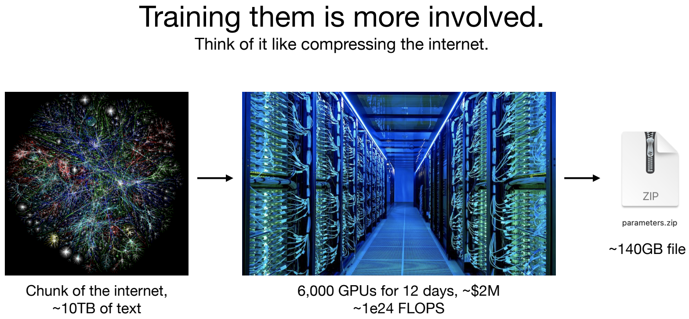
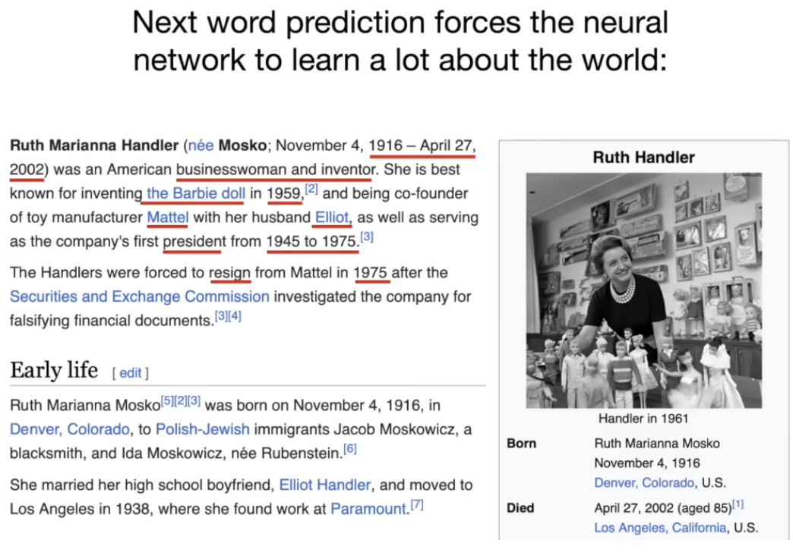
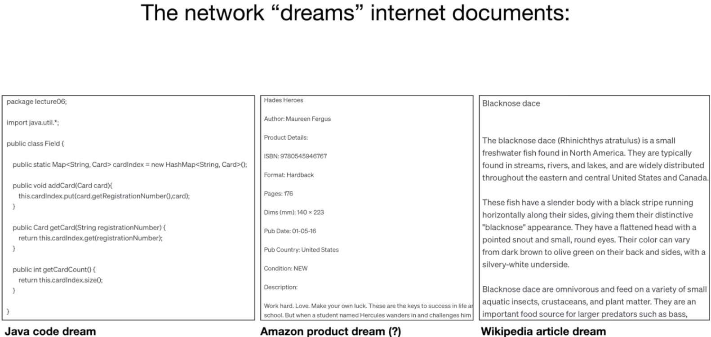
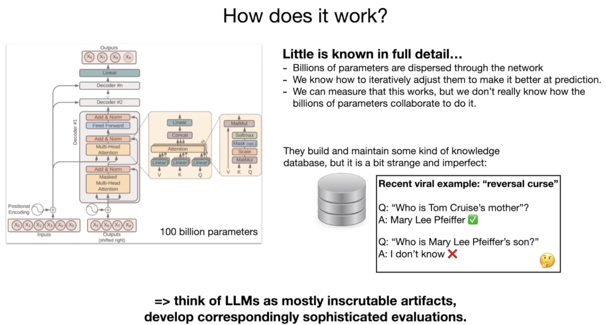
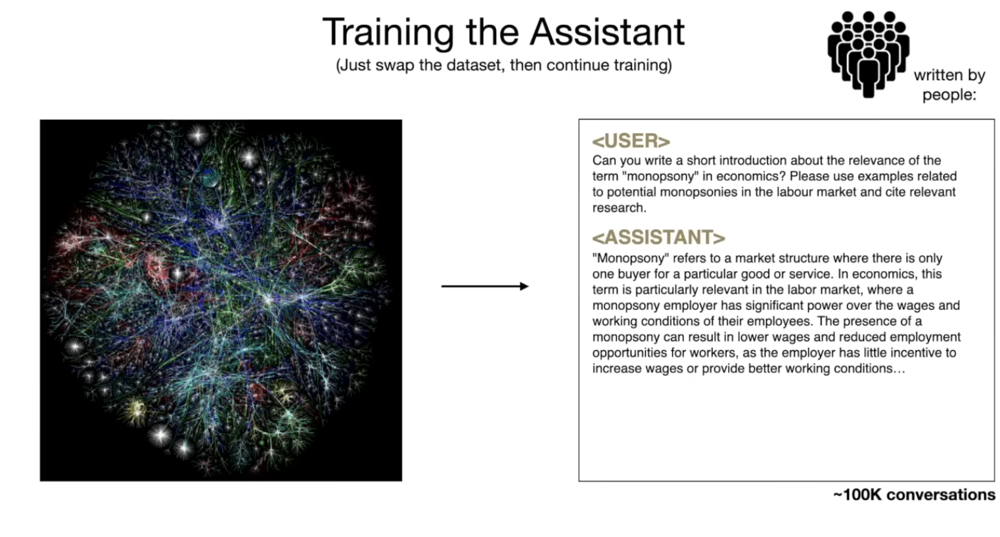
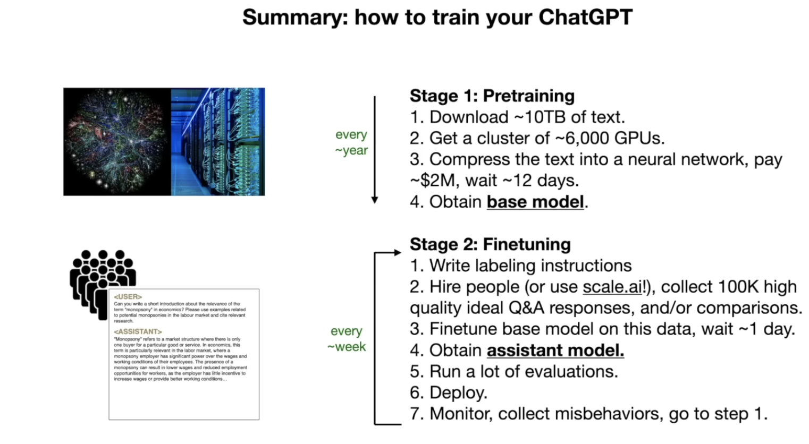

Slides: https://drive.google.com/file/d/1pxx_ZI7O-Nwl7ZLNk5hI3WzAsTLwvNU7/view

### What is a Large Language Model?

It's just 2 files (parameter 140GB and run.c ~500 C LOC), for example for the `llama-2-70b` large language model released by Meta AI, llama series, the 2nd iteration of it and this is the 70 billion parameter of the series. There's multiple models belonging to the Llama 2 Series: 7 billion, 13 billion, 34 billion and 70 billion (biggest one). Many people like this model specifically because it is probably today's the most powerful open weights model, so basically: the weights, the architecture and a paper was all released by Meta so anyone can work with this model very easily by themselves. This is unlike many other language models that you might be familiar with, for example, if you're using chatGPT, the model architecture was never released as it is owned by OpenAI and you're allowed to use the language model through a web interface but you don't have actually access to that model. 

In this case, the Llama 2 70b model is just two files on your filesystem: the parameters file and the code that runs those parameters. The parameters are basically the weights or the parameters of this neural network that is the language model. 

Because this is a 70 billion parameter modele every one of those parameters is stored as 2 bytes and so therefore the parameters file here is 140 gigabytes and it's two bytes because this is a Float16 number as the data type now. In addition to these parameters, that's just like a large list of parameters for that neural network you also need something that runs that neural network and this piece of code is implemented in our `run file` now this could be a C file or a Python file or any other programming language really it can be written any arbitrary language but C is sort of like a very simple language just to give you a sense and it would only require about 500 lines of C with no other dependencies to *implement the the  neural network architecture and that uses basically the parameters to run the model* so it's only these two files you can take these two files and you can take your MacBook and this is a *fully self-contained package* this is everything that's necessary *you don't need any connectivity to the internet* or anything else. 

To run the model:

- you can take these two files
- compile your C code
- you get a binary that you point at the parameters
- and you can talk to this language model
- for example you can send it text like "Write a poem about the company ABC"
- And this language model will start generating text following the directions and give you a poem about ABC 

In the presentation, running a 7 billion parameter model not a 70 billion as it would be 10 times slower.

This is a very small package but the computational complexity really comes in when we'd like to *get those parameters*.

### How do we get the parameters and where are they from?  

Because whatever is in the run.c file, the neural network architecture and sort of the forward pass of that Network, everything is algorithmically understood and open but the ~magic really is in the parameters and how do we obtain them~. 

To obtain the parameters, basically the **model training**, as we call it, is a lot more involved than **model inference** which is the part that I showed you earlier with tne poem. 

Model inference is just running it on your MacBook while model training is a computationly very involved process process.
It can best understood as kind of a **compression of a good chunk of Internet** so because llama 2 70b is an open source model we know quite a bit about how it was trained because Meta released that information in paper.

The numbers of what's involved

1) Take a chunk of the internet, 10 TB of text this typically comes from like a crawl of the internet so just imagine collecting tons of texts from all kinds of different websites and collecting it together 

2) Procure a GPU cluster, a very specialized computers intended for very heavy computational workloads like training of neural networks you need about 6,000 gpus and you would run this for about 12 days to get a llama 270b and this would cost you about $2 million and what this is doing is basically: compressing this large chunk of text

You can think of it as a kind of a zip file of the internet and and what would come out are these parameter is 140 GB so you can see that the compression ratio here is roughly like 100x.
But this is not exactly a zip file because a zip file is lossless compression, here is a **lossy compression** we're ***getting a kind of a Gestalt of the text that we trained on we don't have an identical copy of it in these parameters*** 

Those are rookie numbers so if you want to think about state-of-the-art neural networks like chatGPT or Claude or Bard these numbers are off by factor of 10 or more so you would just start multiplying by quite a bit more. 

That's why these training runs today are many tens or even potentially hundreds of millions of dollars very large clusters very large data sets and this process here is very involved to get those parameters once you have those parameters running the neural network is fairly computationally cheap. 

### What is this neural network really doing?

I mentioned that there are these parameters, this neural network basically is just trying to **predict the next word in a sequence**

1) You can feed in a sequence of words for example *"cat sat on a"*
2) This feeds into a neural net
3) These parameters are dispersed throughout this neural network and there's neurons and they're connected to each other and they all fire in a certain way
4) Out comes a prediction for what word comes next, in this case, this neural network might predict that, in this context of four words, the next word will probably be *"mat"* with 97% probability 

This is fundamentally the problem that the neural network is performing and this can show mathematically that there's **a very close relationship between prediction and compression** which is why I sort of allude to this neural network as a kind of training it is kind of like a compression of the internetbecause if you can predict  sort of the next word very accurately  you can use that to compress the data set.

So, it's just a next word prediction neural network you give it some words it gives you the next word. 

Now the reason that what you get out of the training is actually quite a magical artifact is that basically the next word predition task you might think is a very simple objective but it's actually a pretty powerful objective because it forces you to learn a lot about the world inside the parameters of the neural network so here I took a random web page at the time when I was making this talk I just grabbed it from the main page of Wikipedia and it was about Ruth Handler:

So think about being the neural network and you're given some amount of words and trying to predict the next word in a sequence. In this case I'm highlighting here in red some of the words that would contain a lot of information and so for example if your objective is to predict the next word presumably your parameters have to learn a lot of this knowledge you have to know about: Ruth and Handler and when she was born and when she died  who she was  what she's done and so on and so in the task of next word prediction you're learning a ton about the world and all this knowledge is being **compressed into the weights, the parameters** 

### How do we actually use these neural networks?

Well once we've trained them I showed you that the model inferenceis is a very simple process: 

1) we basically generate what comes next, we sample from the model so we pick a word 
3) and then we continue feeding it back in
4) and get the next word 
5) and continue feeding that back in 

So we can iterate this process and this network then **dreams internet documents** so for example if we just run the neural network or as we say *perform inference* we would get sort of like web page dreams you can almost think about it that way right because this network was trained on web pages and then you can sort of like let it loose

On the left we have some kind of a Java code dream, in the middle we have some kind of an Amazon product dream and on the right we have something that almost looks like Wikipedia article.

Focusing for a bit on the middle one, as an example, the title the author the ISBN number everything else this is all just totally made up by the network. The network is dreaming text  from the distribution that it was trained on: it's just mimicking these documents but this is all kind of like hallucinated so for example the ISBN number this number probably I would guess almost certainly does not exist. The model Network just knows that what comes after ISB and colon is some kind of a number of roughly this length and it's got all these digits and it just like puts it in it just kind of like puts in whatever looks reasonable so it's parting the training data set distribution.

On the right the Blacknose dace, it is actually a kind of fishand what's happening here is this text verbatim is not found in a training set documents but this information if you actually look it up is actually roughly correct with respect to this fish and so the network has knowledge about this fish, it knows a lot about this fish it's not going to exactly parrot  documents that it saw in the training set but again it's some kind of a l some kind of a lossy compression of the internet it kind of remembers the Gestalt it kind of knows the knowledge and it just kind of like goes and it creates the form it creates kind of like the correct form and fills it with some of its knowledge and you're never 100% sure if what it comes up with is as we call hallucination or like an incorrect answer or like a correct answer necessarily so some of the stuff could be memorized and some of it is not memorized and you don't exactly know which is which. 

But for the most part this is just kind of like hallucinating or like dreaming internet text from its data distribution 

### How does this network work? How does it actually perform this next word prediction task? What goes on inside it?

This is where things complicate a little bit this is kind of like the schematic diagram of the neural network if we kind of like zoom in into the toy diagram of this neural net

This is what we call the **Transformer neural network architecture** and this is kind of like a diagram of it:

What's remarkable about these neural nets is we actually understand in full detail the architecture. 

We know exactly what mathematical operations happen at all the different stages of it.

The problem is that these 100 billion parameters are dispersed throughout the entire neural network work and so basically these billions of parameters are throughout the neural net and all we know is how to adjust these parameters iteratively to make the network as a whole better at the next word prediction task. 

So we know how to optimize these parameters we know how to adjust them over time to get a better next word prediction but we don't actually really know what these 100 billion parameters are doing we can measure that it's getting better at the next word prediction but we don't know how these parameters collaborate to actually perform that

We have some kind of models that you can try to think through on a high level for what the network might be doing so we kind of understand that they build and maintain some kind of a knowledge database but even this knowledge database is very strange and imperfect and weird. 

So a recent viral example is what we call the "reversal course" if you go to chatGPT and you talk to GPT 4 the best language model currently available you say 

"who is Tom Cruz's mother?" it will tell you it's Mery Lee Pfeifer which is correct but if you say 
"who is merely Fifer's son?" it will tell you it doesn't know .

So this knowledge is weird and it's kind of one-dimensional and you have to sort of like this knowledge isn't just like stored and can be accessed in all the different ways you have to ask it from a certain direction almost and so that's really weird and strange and fundamentally we don't really know because all you can kind of measure is whether it works or not and with what probability. 

So long story short think of llms as kind of inscrutable artifacts they're not similar to anything else you might might built in an engineering discipline like they're **not like a car where we sort of understand all the parts** there are these neural nets that come from a long process of optimization and so **we don't currently understand exactly how they work** although there's a field called interpretability or or mechanistic interpretability trying to kind of go in and try to figure out like what all the parts of this neural net are doing and you can do that to some extent but not fully right now but right now we kind of what **treat them mostly as empirical artifacts we can give them some inputs and we can measure the outputs** we can basically measure their behavior we can look at the text that they generate in many different situations and so I think this requires basically correspondingly sophisticated evaluations to work with these models because they're mostly empirical.

### How we actually obtain an assistant?

So far we've only talked about these internet document generators and that's the first stage of training we call that stage **pre-training** we're now moving to the second stage of training which we call **fine-tuning** and this is where we obtain what we call an ***assistant model*** because we don't actually really just want a document generators that's not very helpful for many tasks we want to give questions to something and we want it to generate answers based on those questions so we really want an assistant model instead.

To obtain these assistant models is fundamentally through the following process: we basically keep the optimization identical so the training will be the same it's just the next word prediction task but we're going to **swap out the data set** on which we are training so it used to be that we are trying to  train on internet documents we're going to now swap it out for **data sets that we collect manually** and the way we collect them is by using lots of people so typically a company will hire people and they will give them *labeling instructions* and they will ask people *to come up with questions and then write answers for them*. 

Here's an example of a single example that might basically make it into your training set: there's a user and it says something like "can you write a short introduction about the relevance of the term monopsony in economics?" and so on and then there's assistant and again the person fills in what the ideal response should be and the ideal response and how that is specified and what it should look like all just comes from labeling documentations that we provide these people and the engineers at a company like openAO or anthropic or whatever else will come up with these labeling documentations.

Now the pre-training stage is about a *large quantity of text but potentially low quality* because it just comes from the internet and there's tens of or hundreds of terabyte Tech off it and it's not all very high quality but *in this second stage we prefer quality over quantity so we may have many fewer documents for example 100,000 but all these documents now are conversations and they should be very high quality conversations* and fundamentally people create them based on abling instructions 

So we swap out the data set now and we train on these Q&A documents and this process is called **fine tuning** once you do this you obtain what we call an **assistant model** so this assistant model now subscribes to the form of its new training documents so for example if you give it a question like "can you help me with this code? it seems like there's a bug" print Hello World even though this question specifically was not part of the training set, the model after its fine-tuning understands that it should answer in the style of a **helpful assistant** to these kinds of questions and it will do that so it will sample word by word again from left to right from top to bottom all these words that are the response to this query and so it's kind of remarkable and also kind of empirical and not fully understood that these models are able to sort of like change their formatting into now being helpful assistants because they've seen so many documents of it in the fine chaining stage but they're still able to access and somehow utilize all the knowledge that was built up during the first stage the pre-training stage so roughly speaking pre-training stage trains on a ton of internet and it's about knowledge and the fine truning stage is about what we call **alignment** it's about changing the formatting from internet documents to question and answer documents in kind of like a helpful assistant manner. 

### How to train your chatGPT?

Roughly speaking here are the two major parts of obtaining something like chatGPT:

1) Pre-training: you get a ton of text from the interne. You need a cluster of GPUs so these are special purpose computers for these kinds of parell processing workloads (very expensive computers) and then you compress the text into this neural network into the parameters of it, typically this could be a few millions of dollarsand then this gives you the **base model** because this is a very computationally expensive part this only happens inside companies maybe *once a year* or once after multiple months because this is kind of like **very expensive** to actually perform once.

2) Fine-tuning: once you have the base model you enter the stage which is computationally a lot cheaper in this stage you write out some labeling instructions that basically specify how your assistant should behave then you hire peoples for example scaleAI is a company that actually would would work with you to actuallybasically create documents according to your labeling instructions you collect 100,000 as an example high quality ideal Q&A responses and then you would fine-tune the base model on this data this is a lot cheaper this would only potentially take like one day or something like that instead of a few  months or something like that and you obtain what we call an assistant model then you run a lot of evaluation you deploy thisand you monitor collect misbehaviors and for every misbehavior you want to fix it and you go to step on and repeat and the way you fix the misbehaviors roughly speaking is you have some kind of a conversation where the Assistant gave an incorrect response so you take that and you ask a person to fill in the correct response and so the the person overwrites the response with the correct one and this is then inserted as an example into your training data and the next time you do the fine training stage the model will improve in that situation so that's the iterative process by which you improve this. Because fine tuning is a lot cheaper you can do this **every week every day** or so onand companies often will *iterate a lot faster on the fine training stage instead of the pre-training stage* 

One other thing to point out is for example I mentioned the Llama 2 series The Llama 2 Series actually when it was released by meta contains contains both *the base models* and the *assistant models* so they release both of those types. 

The base model is not directly usable because it doesn't answer questions with answers  it will if you give it questions it will just give you more questions or it will do something like that because it's just an internet document sampler so these are not super helpful where they are helpful is that meta has done the very expensive part of these two stages they've done the stage one and they've given you the result and so you can go off and you can do your own fine-tuning and that gives you a ton of freedom but meta in addition has also released *assistant models* so if you just like to have a question answer  you can use that assistant model and you can talk to it. 

Those are the two major stages now see how in stage 2 I'm saying end or comparisons I would like to briefly double click on that because there's also a stage 3 of fine tuning that you can optionally go to or continue to. In stage three of fine tuning you would use comparison labels.